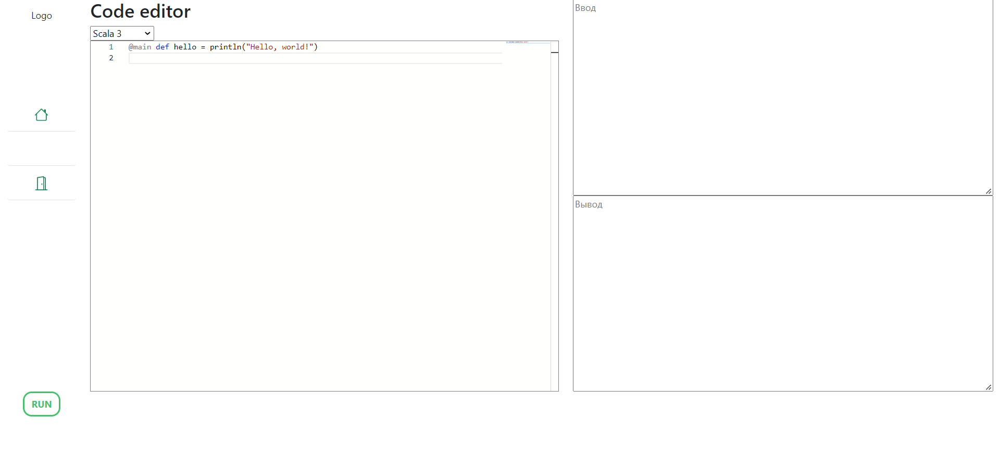

# InterCompiler UI



Пользовательская часть проекта онлайн компилятора.

Проект для презентации на Highload++ 2022 Foundation.

## Установка

### Необходимо

* Python (разрабатывалось на 3.9.7);
* NPM.

### Процесс установки

Создать виртуальное окружение (разрабатывалось на 3.9.7)
```bash
python3 -m venv venv
```

Установить в него зависимости
```bash
python3 -m pip install -r requirements.txt
```

Установить зависимости для UI
```bash
cd static
npm install
```

## Запуск

```bash
python3 manage.py runserver
```
